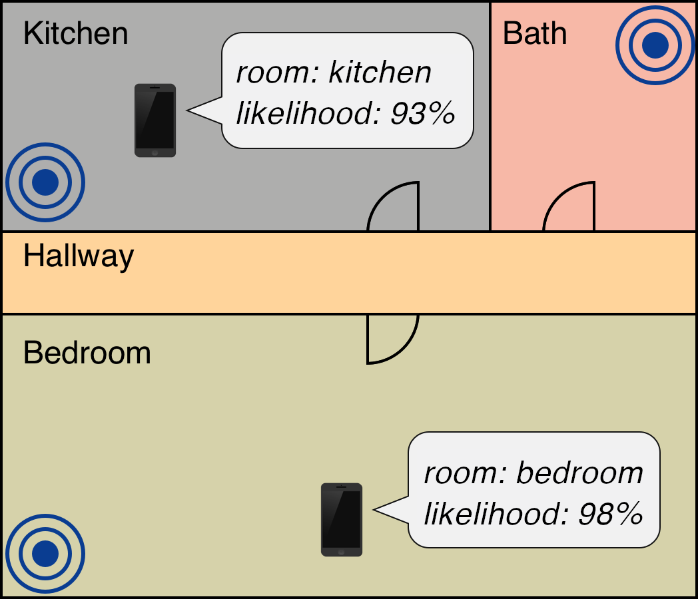
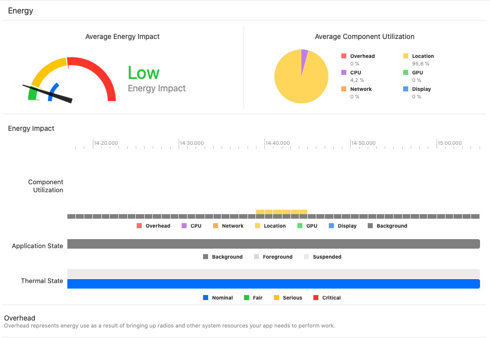

### Update
Currently I do not have time to keep `rooms` updated. 
Please consider this project should be considered a `proof-of-concept`.
If you would like to contribute to further development, please contact me or open an issue. 

# `rooms`
**TL;DR** Another way to perform room presence detection based on low-cost BLE beacons for mobile devices. MQTT support for smart-home integration. iOS only.

With `rooms` mobile devices can perform indoor self-localization using an app and low-cost BLE beacons.
Its focus is the localization of mobile devices using low-cost COTS (commercial-off-the-shelf) hardware, e.g., the ESP32. 
By configuring and deploying multiple ESP32's as iBeacon transmitters into a region (e.g. an apartment, house, etc.), a mobile app on the device can detect in which room/area of the region the device currently is. 
It then uses MQTT to publish the determined region to an MQTT broker. 
The current room is estimated from the combination of RSSI values obtained from all beacons in range (RSSI fingerprinting) using a Machine Learning model.

Here is a neat little demo with two rooms.
The device is moved from the `Badezimmer` (bathroom in german) to the `Flur` (hallway in german) and back. 
As you can see, `rooms` is able to quickly detect the change of the device location.

The prediction runs entirely on the device, giving full control to the user about if and how the data is shared. 
It is not possible for the iBeacons to detect if a device is performing self-localization with `rooms` or not. 

To perform the RSSI sensing and ML inference, the app must run in the background. 
As Apple App Store guidelines restrict this, the app can not be published on the official App Store.
Therefore, ** to use `rooms` you need to download and compile it yourself. **
For more inforation on power consumption and system utilization, please refer to the "Additional Information" section below.

# Getting Started

## Setting up your Beacon environment
It should be possible (not tested yet!) to use all kinds of different Beacon hardware. 
To use iBeacons with `rooms` you need to setup your beacons to all use the same UUID and Major value.
Give each beacon a unique Minor value to differ between Beacons.
To use ESP32 with iBeacon, I recommend to check out [ESPHome](https://esphome.io). 
They have a tutorial how to set everything up and configure ESP32 to transmit as iBeacons [here](https://esphome.io/components/esp32_ble_beacon.html?highlight=beacon).

## Setting up the app
On the first launch, the app won't do anything until it is properly configured.
The process to get it running requires the following steps.
1. Setup your beacons
2. Setup your rooms
3. Setup MQTT (optional)
4. Collect training data from each room/area (~ two-three minute per room)
5. Export your data to train the AI specific to your setup (currently done with Python script)
6. Import the AI model back to the app
7. Done :)
Below all steps are described in more detail.

### 1. Setup your iBeacons

Go to __Settings__ > __Beacons__ and configure your global UUID and Major value. Don't forget to type __Set__ to confirm the values.
Then add all Minor values of your Beacons to the list below.
Swipe down once you are finished.

### 2. Setup your Rooms/Areas

Go to __Settings__ > __Rooms__ and add all your rooms/areas you want your device to detect to the list.

### 3. Setup MQTT (optional)

If you want the app to report changes of location to your MQTT broker, you need to configure it.
Go to __Settings__ > __MQTT__ and configure fill out all required fields. 
Tap __Set__ to make sure the value is properly configured!
To test the connection, press __Test__ at the very bottom of the display. 
If everything works out, the red __X__ changes to a checkmark and you should find a short MQTT message on the specified topic.

### 4. Collect training data

Go to __Data__ and choose a room using the _Choose Room from List_ button. You should be able to see all rooms previously configured in step 2.
Once selected, move your device to the room and press _Start Recording_. The device will then start to collect readings from your beacons.
To get better results, you should move in the room and open/close doors. Also put the device in your pocket and move around (don't just stand still).
__Don't leave the room during this process!__
The time required per room depends on whats configured for the _Number of Training Samples per Room_ in the __Settings__ tab. The app will record one sample/second. Larger numbers of training samples _might_ give you better results later, but also take more time to accuire.
Repeat the process for every room.

### 5. Export the data and train your own AI

Once the data is collected for all rooms, you must export the data. 
The app generates on JSON file for each room with the collected samples.
Pressing the _Export_ button will open the default iOS share dialogue and allow you to export your files.
Export your files to where you can access them with your computer.
To train your model, copy the exported JSON files to the _machine-learning-python_ folder in the repository and run the script with the appropriate options (*--num-beacon* is the only required option). 
To setup the python environment, you can use "pipenv" with the provided pipfiles.
Use *--help* to learn about the other options.

### 6. Import the AI model back to the app

To import your model back into the app, you must provide it at a valid URL link.
You can use the python scripts integrated option (pass the argument *--http* to run a server on your machine) or use NGINX to setup your own server.
Go to __Settings__ > __Model__ and paste the link to the model there. Press _Set_ and the _Import_. 
If everything works, the app will import your own model from the URL and compiles it.

### 7. Start the prediction

Finally, go to the initial __Prediction__ tab. 
Wait for a few seconds to allow the app to compile your model and start collecting readings from your BLE beacons. 
After a few seconds it should show in which room you are currently in. 
If you configured MQTT, a new message will be published to the configured topic every time the room changes.

# Additional Information

Here are some results of the resource impact of the approach on your device (e.g., CPU usage, battery impact).

To reduce power consumption, beacon measurements are only collected if the device is moved. 
For movement detection movement, the app monitors the devices’ gyroscope.
To avoid accidentally draining the device battery, `rooms` suspends all activities when the device battery goes below 30% and the device is not charging.

More discussions of the approach are available on [this](https://community.home-assistant.io/t/area-room-presence-detection-for-mobile-devices-using-esp32-based-ble-beacons/202622/21) Home-Assistant forum post. 

## Future
RSSI is not a real high-value wireless channel feature, just the best we can get with cheap hardware and reasonable effort at the moment.
I think with better hardware, more advanced wireless channel features for the learning, e.g., multipath-parameters, or time-difference of arrival.